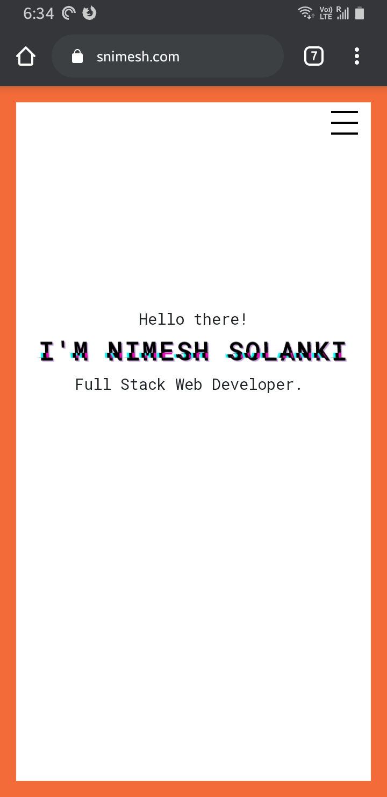

# [Resume Website](https://snimesh.com) v2.1

Website URL: https://snimesh.com

## Screenshots

### [Desktop View](https://snimesh.com)

### [Mobile View](https://snimesh.com)

## ❤️ Credits

- [Node.js](https://nodejs.org/)
- [React.js](https://reactjs.org/)
- [Netlify](https://www.netlify.com/)

## 🎓 License

[MIT](LICENSE)