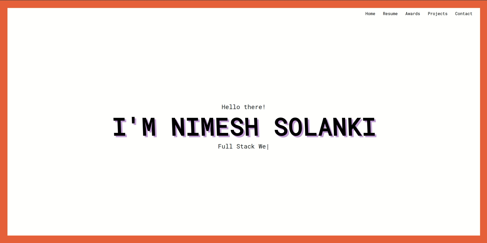

# Resume Website v2.1

## Screenshots

### Desktop View

### Mobile View

## ❤️ Credits

- [Node.js](https://nodejs.org/)
- [React.js](https://reactjs.org/)
- [Netlify](https://www.netlify.com/)

## 🎓 License

[MIT](LICENSE)